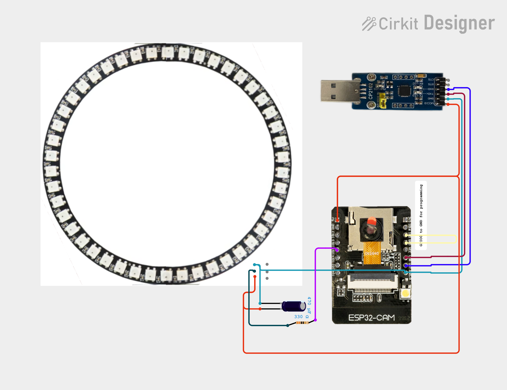
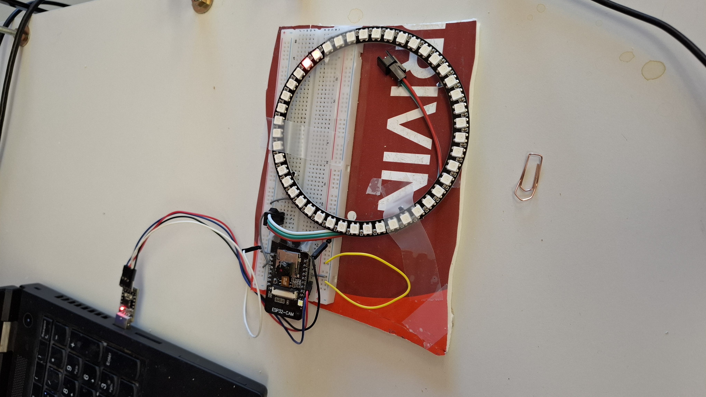

# **Circuit Documentation**

## **Summary**

This circuit integrates an ESP32-CAM module, a CP2102 USB-to-UART bridge, a NEOPIXEL WS2812 45 LED ring, a resistor, and an electrolytic capacitor. The ESP32-CAM is programmed to control the LED ring, creating a visual effect by chasing a red dot around the ring. The CP2102 facilitates communication between the ESP32-CAM and a computer for programming and debugging. The resistor is used to limit current to the LED ring, and the capacitor helps stabilize the power supply.

## **Component List**

1. **CP2102 USB-to-UART Bridge**  
   * **Description**: A USB-to-UART bridge used for serial communication.  
   * **Pins**: VCC IO, GND, TXD, RXD, RTS, CTS  
2. **NEOPIXEL WS2812 45 LED Ring**  
   * **Description**: A ring of 45 individually addressable RGB LEDs.  
   * **Pins**: GND, D1, 5V, D0  
3. **Resistor**  
   * **Description**: A 330 Ohm resistor used to limit current.  
   * **Pins**: pin1, pin2  
   * **Properties**: Resistance: 330 Ohms  
4. **ESP32-CAM**  
   * **Description**: A microcontroller with integrated camera and Wi-Fi capabilities.  
   * **Pins**: 5V, GND, OI12, OI13, IO15, IO14, IO2, IO1, 3V3, IO16, IO0, VCC, UOR, UOT, GND/R  
5. **Electrolytic Capacitor**  
   * **Description**: A capacitor used for power stabilization.  
   * **Pins**: \-, \+  
   * **Properties**: Capacitance: 0.00047 Farads

## **Wiring Details**

### **CP2102 USB-to-UART Bridge**

* **GND** is connected to the GND of the Electrolytic Capacitor, NEOPIXEL WS2812 45 LED Ring, and ESP32-CAM.  
* **TXD** is connected to the UOR pin of the ESP32-CAM.  
* **RXD** is connected to the UOT pin of the ESP32-CAM.  
* **VCC IO** is connected to the \+ pin of the Electrolytic Capacitor, 5V pin of the NEOPIXEL WS2812 45 LED Ring, and 5V pin of the ESP32-CAM.

### **NEOPIXEL WS2812 45 LED Ring**

* **GND** is connected to the GND of the CP2102, Electrolytic Capacitor, and ESP32-CAM.  
* **D1** is connected to pin1 of the Resistor.  
* **5V** is connected to the VCC IO of the CP2102, \+ pin of the Electrolytic Capacitor, and 5V pin of the ESP32-CAM.

### **Resistor**

* **pin1** is connected to the D1 pin of the NEOPIXEL WS2812 45 LED Ring.  
* **pin2** is connected to the IO15 pin of the ESP32-CAM.

### **ESP32-CAM**

* **GND/R** is connected to the GND of the CP2102, Electrolytic Capacitor, and NEOPIXEL WS2812 45 LED Ring.  
* **UOR** is connected to the TXD pin of the CP2102.  
* **UOT** is connected to the RXD pin of the CP2102.  
* **5V** is connected to the VCC IO of the CP2102, \+ pin of the Electrolytic Capacitor, and 5V pin of the NEOPIXEL WS2812 45 LED Ring.  
* **IO15** is connected to pin2 of the Resistor.  
* **IO0** is connected to the GND pin of the ESP32-CAM.

### **Electrolytic Capacitor**

* **\-** is connected to the GND of the CP2102, NEOPIXEL WS2812 45 LED Ring, and ESP32-CAM.  
* **\+** is connected to the VCC IO of the CP2102, 5V pin of the NEOPIXEL WS2812 45 LED Ring, and 5V pin of the ESP32-CAM.

## **Photo**

(no resitor or capacitance)
 

