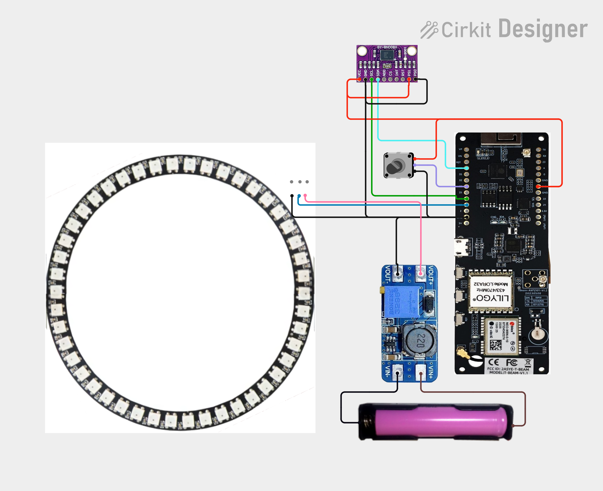

# **Circuit Documentation**

## **1\. Circuit Summary**

This circuit combines a LILYGO T-Beam Meshtastic LORA32 868 MHz controller with:

> * A BNO085 motion sensor.  
> * A 45-pixel WS2812 NeoPixel ring.  
> * A potentiometer connected to an analog input.  
> * An 18650 battery and MT3608 boost converter used to provide approximately 5 V to the NeoPixel ring.

The T-Beam interfaces with the BNO085 using two GPIO pins, drives the NeoPixel ring from another GPIO, and reads the potentiometer wiper through an analog-capable GPIO.  
The circuit and program is intended to test the potentiometer and Neopixelring together. By rotating the potentiometer from zero to full, the LED is changing it's position between 0 ... 360 degrees. In this code setup, the BNO085 has no function at all.

## ---

**2\. Component List**

### **LILYGO T-Beam Meshtastic LORA32 868 MHz**

The T-Beam is the primary microcontroller and wireless processing board. It provides the GPIO interfaces for the BNO085, NeoPixel ring, and potentiometer.  
Used connections:

> * GPIO 14: BNO085 clock or serial interface signal.  
> * GPIO 15: BNO085 data or serial interface signal.  
> * GPIO 13: NeoPixel data output.  
> * GPIO 33: Potentiometer analog input.  
> * 3V3: BNO085 and potentiometer supply.  
> * GND: Common circuit ground.

The board’s other listed pins are not connected in the supplied net list.

### ---

**BNO085**

The BNO085 is an intelligent nine-axis motion sensor capable of providing orientation, acceleration, gyroscope, and related motion data.  
Used connections:

> * VCC: Connected to the T-Beam 3.3 V supply.  
> * GND: Connected to common ground.  
> * PS1: Connected to VCC.  
> * PS0: Connected to ground.  
> * SCL/SCK/RX: Connected to T-Beam GPIO 14\.  
> * SDA/MISO/TX: Connected to T-Beam GPIO 15\.

The following pins are unconnected:

> * ADR/MOSI  
> * CS  
> * INT  
> * RST

### ---

**NEOPIXEL WS2812 45 LED Ring**

The NeoPixel ring contains 45 individually addressable WS2812 LEDs.  
Used connections:

> * 5V: Supplied from the MT3608 boost converter output.  
> * GND: Connected to common ground.  
> * D1: Connected to T-Beam GPIO 13\.

### ---

**18650 in Holder**

The 18650 battery holder provides the primary battery source for the boost converter.  
Used connections:

> * VCC: Connected to the MT3608 VIN+ input.  
> * GND: Connected to the MT3608 VIN- input.

The battery voltage varies with charge state. A single 18650 cell is typically approximately 4.2 V when fully charged and can fall to around 3.0 V or lower during discharge. The battery should include suitable protection, or a protected cell and appropriate battery-management circuitry should be used.

### ---

**MT3608 Boost Converter**

The MT3608 boosts the 18650 battery voltage to a higher output voltage for the NeoPixel ring.  
Used connections:

> * VIN+: Connected to the 18650 holder VCC.  
> * VIN-: Connected to the 18650 holder GND.  
> * VOUT+: Connected to the NeoPixel ring 5V.  
> * VOUT-: Connected to common ground.

The MT3608 output voltage must be adjusted to the desired value before connecting the NeoPixel ring. A nominal 5 V setting is appropriate for the WS2812 ring, but the output should be measured with a multimeter.  
The MT3608 output is not connected to the T-Beam supply in the supplied net list.

### ---

**POT**

The potentiometer provides a variable analog voltage to the T-Beam.  
Used connections:

> * A: Connected to the T-Beam 3V3 supply.  
> * E: Connected to common ground.  
> * S: Connected to T-Beam GPIO 33\.

The potentiometer wiper produces an adjustable voltage between approximately 0 V and 3.3 V. GPIO 33 is an analog-capable ESP32 input and is suitable for reading the wiper voltage, assuming the particular T-Beam revision supports this pin as expected.

## ---

**3\. Wiring Details by Component**

### **LILYGO T-Beam Meshtastic LORA32 868 MHz**

| T-Beam Pin | Connected To | Function   |
| :---- | :---- | :---- |
| 14 | BNO085 SCL/SCK/RX | Sensor clock or receive signal, depending on interface mode |
| 15 | BNO085 SDA/MISO/TX | Sensor data or transmit signal, depending on interface mode |
| 13 | NeoPixel ring D1 | WS2812 data output |
| 33 | Potentiometer S | Analog potentiometer input |
| 3V3 | BNO085 VCC, BNO085 PS1, potentiometer A | 3.3 V supply and interface-mode configuration |
| GND | BNO085 GND, BNO085 PS0, MT3608 VOUT-, potentiometer E, NeoPixel GND | Common ground |

No connection is specified from the battery or MT3608 output to the T-Beam power input. The T-Beam therefore has no documented power source in the supplied circuit description.

### ---

**BNO085**

| BNO085 Pin | Connected To | Function   |
| :---- | :---- | :---- |
| VCC | T-Beam 3V3 | 3.3 V sensor supply |
| GND | Common ground | Ground return |
| PS1 | T-Beam 3V3 | Interface-mode selection |
| PS0 | Common ground | Interface-mode selection |
| SCL/SCK/RX | T-Beam GPIO 14 | Clock or receive signal |
| SDA/MISO/TX | T-Beam GPIO 15 | Data or transmit signal |
| ADR/MOSI | Unconnected | No connection specified |
| CS | Unconnected | No connection specified |
| INT | Unconnected | No interrupt connection specified |
| RST | Unconnected | No reset connection specified |

The BNO085 communication protocol cannot be conclusively identified from the net list alone because the signal names support multiple protocols. The firmware must match the hardware configuration selected by PS0 and PS1.

### ---

**NEOPIXEL WS2812 45 LED RING**

| NeoPixel Pin | Connected To | Function   |
| :---- | :---- | :---- |
| 5V | MT3608 VOUT+ | LED ring power |
| GND | Common ground | Power return |
| D1 | T-Beam GPIO 13 | Serial LED data input |
| D0 | Unconnected | Not used in the supplied circuit |

Recommended practical additions, not present in the supplied net list, include:

> * A bulk capacitor across the ring’s 5 V and GND inputs.  
> * A series resistor, commonly around be 220–470 Ω, in the data line near the first pixel.  
> * A suitable 3.3 V-to-5 V logic-level translator if reliable data reception is not achieved.

### ---

**18650 in Holder**

| Battery Pin | Connected To | Function   |
| :---- | :---- | :---- |
| VCC | MT3608 VIN+ | Positive battery connection |
| GND | MT3608 VIN- | Negative battery connection |

The battery polarity must be verified before powering the circuit. The holder and wiring should be rated for the expected NeoPixel current and boost-converter input current.

### ---

**MT3608 Boost Converter**

| MT3608 Pin | Connected To | Function   |
| :---- | :---- | :---- |
| VIN+ | 18650 holder VCC | Battery positive input |
| VIN- | 18650 holder GND | Battery negative input |
| VOUT+ | NeoPixel ring 5V | Boosted positive output |
| VOUT- | Common ground | Boosted output return |

The MT3608 output voltage should be adjusted and measured under appropriate conditions. The converter must be capable of supplying the required current without excessive voltage drop or overheating.

### ---

**POT**

| Potentiometer Pin | Connected To | Function   |
| :---- | :---- | :---- |
| A | T-Beam 3V3 | Positive potentiometer supply |
| E | Common ground | Potentiometer ground |
| S | T-Beam GPIO 33 | Variable analog output |

The potentiometer output should remain within the T-Beam’s permitted GPIO input range. With the supplied connections, the expected range is approximately 0–3.3 V.

## ---

**4\. Power and Grounding**

The circuit contains two nominal supply domains:

### **3.3 V Domain**

Supplied by the T-Beam:

> * BNO085 VCC  
> * BNO085 PS1  
> * Potentiometer terminal A

### **Boosted 5 V Domain**

Supplied by the MT3608:

> * NeoPixel ring 5V

### **Common Ground**

The following are connected to a common ground net:

> * T-Beam GND  
> * BNO085 GND  
> * BNO085 PS0  
> * MT3608 VOUT-  
> * MT3608 VIN-  
> * 18650 holder GND  
> * Potentiometer E  
> * NeoPixel ring GND

The T-Beam ground and MT3608 output ground are therefore electrically common, allowing the T-Beam data signal to reference the NeoPixel ground.

## ---

